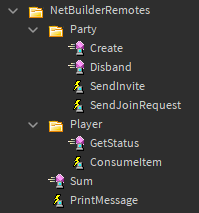
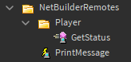

<div>
	<h1><code>NetBuilder</code></h1>
	<h3>Abstract and declarative networking library for Roblox.</h3>
</div>

---

[](https://opensource.org/licenses/MIT)
[](https://www.npmjs.com/package/@rbxts/netbuilder)

NetBuilder is a Roblox networking library, aiming to simplify network management using the [builder pattern](https://refactoring.guru/design-patterns/builder) for creating remote definitions. Gives you full control over input and output values.

## Features
- Builder API for creating and configuring definitions.
- Namespaces for definitions, for better organization.
- Ability to change the namespaces behaviours - Configuration fields can be inherited from its parent namespace and can be overwritten.
- Automatic sort for generated remote trees. By default, if a definition is not being used, it won't be generated.
- Middlewares to have the ability to put your own custom behaviours to remotes. Middlewares have contextual, global and IO mapping support. There are [built-in middlewares](https://github.com/Rimuy/netbuilder/tree/main/src/Middleware) available for use.
- Direct references to definitions for both client and server.
- Supports promise return values (asynchronous functions) for both events and functions.
- AsyncFunctions with timeouts, using `CallAsync`.
- (De)serialization for both parameters and return values.
- Ability to change the logger.

## Goals
- An authentic and straightforward API.
- To make the overall networking development experience in Roblox less stressing.
- Fully customizable definitions by being able to map what is sent and what is received. (Useful for things like string/number manipulation and encryption)

## Non-goals
- Support ClientFunctions ─ The server just shouldn't expect any output from a client at all. Giving a client access to edit whatever is requested from the server, makes your game very vulnerable to exploits due to it having *full control* on what is returned to the server.
It is considered an anti-pattern and should be avoided.
A full and elaborated explanation about that can be found [here](https://www.youtube.com/watch?v=0H_xcA-0LDE).

## Installation
### npm
Simply execute the command below to install it to your [roblox-ts](https://roblox-ts.com/) project.
```bash
npm i @rbxts/netbuilder
```

<!-- ### Wally
For [wally](https://wally.run/) users, the package can be installed by adding the following line into their `wally.toml`.
```cs
[dependencies]
NetBuilder = "rimuy/netbuilder@0.1.0"
```

After that, just run `wally install`. -->

<!-- ### From model file
Model files are uploaded to every release as `.rbxmx` files. You can download the file from the [Releases page](https://github.com/Rimuy/netbuilder/releases) and load it into your project however you see fit. -->

## Definitions Guide
Let's get started with what definitions are, you can skip this part if you're already familiar with this concept.
Definitions are identifier objects that we create to represent remote events/functions, for a more centralized way of sending and receiving requests.

In NetBuilder, a remote instance is only registered and generated if the same is requested. This allows us to create definitions that are going to be useful in the future and to prevent instance duplication.

### Creating definitions
The syntax for creating definitions is pretty straight forward. First we must instantiate `NetBuilder`, which is going to be our point of entry for adding definitions.

Definition builders are abstract, we have `DefinitionBuilder`, which by default builds RemoteEvents. That can be changed by chaining specific methods that changes the definition's behaviour, such as `SetReturn` and `Async`.

By default, the definitions must have typecheckers for every parameter and return value set.
Both builders have a `SetArguments` method. This method takes a list of typecheckers to construct its type definition.
Return value typecheckers are set via `SetReturn`. For the typecheckers, it's recommended to use a library like [t](https://github.com/osyrisrblx/t).

It's also possible to add a namespace that contains another dictionary of remote definitions created by a `NetBuilder` class.

```js
import { NetBuilder, DefinitionBuilder } from "@rbxts/netbuilder";
import { t } from "@rbxts/t";

export = new NetBuilder()
	.BindDefinition(new DefinitionBuilder("PrintMessage").SetArguments(t.string).Build())
	.BindDefinition(
		new DefinitionBuilder("Sum").SetArguments(t.number, t.number).SetReturn(t.number).Build(),
	)
	.BindNamespace(
		"Player",
		new NetBuilder()
			.BindDefinition(new DefinitionBuilder("ConsumeItem").SetArguments(t.number).Build())
			.BindDefinition(new DefinitionBuilder("GetStatus").SetReturn(TypeCheck.PlayerStatus).Build())
			.AsNamespace(),
	)
	.BindNamespace(
		"Party",
		new NetBuilder()
			.BindDefinition(
				new DefinitionBuilder("Create")
					.SetArguments(TypeCheck.PartyInfoCreator)
					.SetReturn(TypeCheck.Party)
					.Build(),
			)
			.BindDefinition(new DefinitionBuilder("Disband").SetArguments(t.number).Build())
			.BindDefinition(new DefinitionBuilder("SendJoinRequest").SetArguments(t.number).Build())
			.BindDefinition(new DefinitionBuilder("SendInvite").SetArguments(t.number, t.number).Build())
			.AsNamespace(),
	)
	.Build();
```

We don't have to specify whether it's a client or server remote, that is meant to be decided when using the definition!

### Using definitions
To use the definitions we have stored, there are dispatchers for both sides that allow us to send and receive requests.

```js
// Client-side
import Definitions from "shared/Remotes";

Definitions.Client.PrintMessage.Send("Hello world!");
Definitions.Client.Player.GetStatus.Call(); // { Level: 1, Atk: 25, Def: 10 }

// Server-side
import Definitions from "shared/Remotes";
import { getPlayerStatus } from "shared/PlayerData";

Definitions.Server.PrintMessage.Connect(print);
Definitions.Server.Player.GetStatus.SetCallback(getPlayerStatus);
```

Alternatively, we can also send requests by directly calling a definition. The method used to call the definition will depend on its kind.

- **Event** -> `Send`
- **Function** -> `Call`
- **AsyncFunction** -> `CallAsync`

```js
Definitions.Client.PrintMessage("Hello world!");
Definitions.Client.Player.GetStatus();
```

Once the game starts, the remote instances are automatically generated in a folder named `NetBuilderRemotes`, located in `ReplicatedStorage`. A way to change the location of the instances will be explained later.



However, the library only generates remote instances for definitions that are actually being used, which means that in the case of the first example showed, it'll likely only generate two remote instances:



This behaviour can be changed to generate remotes for every single definition, regardless of its use, by setting the `PreGeneration` configuration field to true.

> Note: Client functions are not supported, therefore cannot be used and will throw an error if doing so.

### Configuring namespaces
Namespaces are configurable! With the `Configure` method, we're able to change how the library will behave for a specific namespace and its descendants. Any configuration applied to a descendant will overwrite the existing one.

Current available fields for configuration are:
- `RootName` - Changes the default name of the root directory.
- `RootInstance` - Changes the location of the remote instances main directory.
- `SuppressWarnings` - Disables all the warnings emitted from the library.
- `Logger` - Changes the logger to all of the namespace's definitions.
- `PreGeneration` - Generates remotes for all the registered definitions, regardless if they are being used or not.
- `CacheFunctions` - If set to true, functions will always return their latest successful value instead of throwing an error when a middleware fails.
- `Label` - Changes the warning/error messages text between brackets. e.g: `[netbuilder] Could not find remote instance.` -> `[newtext] Could not find remote instance.`
- `Debug` - Activates debug mode.

```js
new NetBuilder()
	.Configure({
		RootName: "MyRemotes",
		SuppressWarnings: true,
	})
	.BindNamespace("Foo",
		new NetBuilder()
			.Configure({
				RootName: "FooRemotes",
			})
			// ...
			.AsNamespace(),
	)
	// ...
	.Build();
```

## Middleware Guide
Middlewares are a way to add custom behaviour to our remotes. They are fully customizable, which means that we are able to change what is sent/received and to drop a request if necessary.

### Using middlewares
As simple as just chaining `UseMiddleware`. It takes a list of middlewares and adds them to the definition's registry.
The middlewares used in the below example are `RateLimiter`, which limits how many request can be made per minute, and `Tracer`, which just executes its callback whenever a request is made, providing some information. Both are globally-enabled and can be namespace-wide!

```js
new NetBuilder()
	.BindDefinition(
		new DefinitionBuilder("Print")
			.SetArguments(t.string)
			.UseMiddleware([
				RateLimiter({ MaxPerMinute: 10 }),
				Tracer((executor) => print(`Hello, ${executor.Name}!`)),
			])
			.Build()
	)
	.Build();
```

Now this is what it looks when we're using them globally. `UseGlobalMiddleware` registers a list of middlewares to the namespace, so any request made will first go through its definition's middlewares, and then the global ones before executing its callback.

```js
new NetBuilder()
	.UseGlobalMiddleware([
		RateLimiter({ MaxPerMinute: 15 }),
		Tracer((executor, definition, ...args) =>
			print(
				`[${definition.Id}]`,
				`${executor.Name} has sent a request with the parameters: [${args.join()}]`,
			),
		),
	])
	.BindDefinition(
		new DefinitionBuilder("Print")
			.SetArguments(t.string)
			.UseMiddleware([RateLimiter({ MaxPerMinute: 5 })])
			.Build()
	)
	.BindDefinition(
		new DefinitionBuilder("Sum")
			.SetArguments(t.number, t.number)
			.SetReturn(t.number)
			.Build()
	)
	.Build();
```

Middlewares cannot be used twice in the same definition. Identifiers are assigned to each middleware so that they can be unique. This prevents duplicates that could potentially be prejudicial to the definition's behaviour.

In this example, both `Print` and `Sum` contains a `RateLimiter`, the difference is that one of them was registered locally. Definition-wide middlewares have priority over namespace-wide ones, so if our definition has a middleware that already exists in the namespace, it'll be overwriten in favour of the local one. So now `Print`'s capacity is only 5 requests per minute!

### Writing a custom middleware
Custom middlewares can be easily created via `NetBuilder.CreateMiddleware`. All middlewares should be created with an ID and a callback that can have arguments that are gonna be used in the custom middleware, and must return a `MiddlewareCreator` object.

It's possible to limit the middleware boundaries, we can choose whether the middleware is gonna be processed on the server or both client and server. If `ServerOnly` is set to true, the object must contain a `Callback` function, otherwise it can contain a `Sender` and a `Receiver` function, which are both optional.

Middleware callbacks are functions that has three parameters: the definition used and two functions for middleware management.
`processNext` and `drop` are functions that once executed, will terminate the its thread and all of the code below it, will be ignored.
The difference between these two is quite clear, while `processNext` takes the new parameters and return value to the next middleware, `drop` will *drop* the request and return an error.

```ts
// LegacySystem.ts
/** Middleware that works half of the time... **/
const LegacySystem = NetBuilder.CreateMiddleware<[errMessage: string]>(
	"LegacySystem",
	(msg) => ({
		ServerOnly: true,
		Callback: (_definition, processNext, drop) => {
			return (player, ...args) => {
				if (os.time() % 2 === 0) {
					drop(msg);
				}

				processNext(args);
			};
		},
	}),
);

export = LegacySystem;

// Remotes.ts
export = new DefinitionBuilder("Hello")
	.UseMiddleware([LegacySystem("This is a very old system, period.")])
	.Build();
```

## Serialization Guide
When talking about serialization for remotes, developers usually use helper functions for their classes to cross the client-server boundary. Well, the main issue with this method is that it's too repetitive. In NetBuilder, this can be simplified a lot by simply implementing the correct methods to the created classes and adding them to the serialization registry.

There is also a second method for serializing existing classes that doesn't contain the serialization methods. Those are called `Serializers`.

### Creating a serializable class
Classes must implement the `Serializable` interface in order to be serializable, which has a static `deserialize` method and a `Serialize` method. Simple as.

```ts
import { Serializable } from "@rbxts/netbuilder";

interface Props {
	name: string;
	age: number;
}

class Person implements Serializable<Props> {
	public constructor(private name: string, private age: number) {}

	public static deserialize({ name, age }: Props) {
		return new Person(name, age);
	}

	public Serialize() {
		return {
			name: this.name,
			age: this.age,
		};
	}

	public Introduce() {
		print(`Hello, my name is ${this.name} and I'm ${this.age} years old!`);
	}

	public IsUnderage() {
		return this.age < 18;
	}
}
```

> *camelCase* is also supported for the serialize method.

### Creating serializers for existing classes
However, you may also want to register an existing class to send their instances over remotes. Since this can't be done using the implementation method, we can use `NetBuilder.CreateSerializer`, a static method for creating *serializers* for objects.

The code below shows exactly how to do that, using our good old `Result` class from [rust-classes](https://github.com/Dionysusnu/rbxts-rust-classes).

```ts
type SResult = { Type: "Ok"; Value: defined } | { Type: "Err"; Error: defined };

NetBuilder.CreateSerializer<SResult>(Result, {
	Serialize(value: Result<defined, defined>) {
		return value.isOk()
			? { Type: "Ok", Value: value.unwrap() }
			: { Type: "Err", Error: value.unwrapErr() };
	},
	Deserialize(serialized) {
		return serialized.Type === "Ok"
			? Result.ok(serialized.Value)
			: Result.err(serialized.Error);
	},
});
```

### Registering serializable classes & serializers
We have our classes ready, but how do we register them? All we need to do is to chain the `UseSerialization` method from the namespace's builder. It takes a list of serializable classes and serializers.

After that, the job is complete and our remote is ready to send and receive requests without having to worry about calling other functions to handle our classes.

```js
// Something.server.ts
import { Server } from "shared/Remotes";

Server.Introduction.Connect((player, person) => {
	person.Introduce();

	if (person.IsUnderage()) {
		return Result.err("Permission denied because the person is underage.");
	}

	return Result.ok("Welp, there you go.");
});

// Definitions.ts
import Person from "../Class/Person";
import RustResult from "../Serializer/RustResult";

export = new NetBuilder()
	.UseSerialization([Person, RustResult])
	.BindDefinition(
		new DefinitionBuilder("Introduction")
			.SetArguments(t.Person)
			.SetReturn(TypeCheck.RustResult)
			.Build()
	)
	.Build();
```

## Useful links
- [Example](example/)
- [License](LICENSE)
